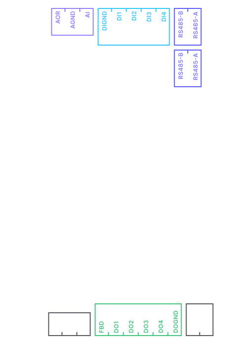

# Description

## Introduction

A [**Programmable Logic Controller (PLC)**](https://en.wikipedia.org/wiki/Programmable_logic_controller) is an industrial-grade digital computer specifically designed for automation of electromechanical processes. PLCs are widely used in industries such as manufacturing, energy, transportation, and building automation to control machinery, processes, and systems. They operate in real-time, ensuring rapid and reliable execution of tasks like switching digital inputs/outputs, reading sensor data, and regulating analog signals. With their robust design, PLCs are built to withstand harsh environments, offering resistance to extreme temperatures, vibrations, and electrical noise. Applications range from simple operations like turning lights on and off to complex tasks such as managing conveyor belts, regulating chemical processes, or automating entire production lines. Their flexibility, scalability, and reliability make PLCs a cornerstone of modern industrial automation.

## Hardware

Each controller is powered by a powerful ARM-based CPU [i.MX 8M Mini](https://www.nxp.com/products/i.MX8MMINI). It also features 1GB RAM and 8GB eMMC internal memory. The chasis is made from aluminium and is rated at IP20. Full hardware specifications for each controller can be found at our [shop](https://shop.robopipe.io).

## Software

Our controllers come pre-installed with a custom **Robopipe OS image**. This image features all software needed for working with your controller, including Robopipe API. It is also pre-configured with sensible defaults so that the controller works right out of the box. The OS image is [Debian](https://www.debian.org/)-based, which means that you can also easily install any packages using [apt](https://en.wikipedia.org/wiki/APT_\(software\)).

## Inputs/Outputs

Arguably, the most important ability of the controller is to be able to controll other devices connected to it. This is done via a number of hardware inputs and outputs on the device. Depending on the specific model of the controller, it features several types and number of these inputs and outputs:

* [DI - digital inputs](inputs-outputs/digital-inputs.md)
* [DO - digital outputs](inputs-outputs/digital-outputs.md)
* [RO - relay outputs](inputs-outputs/relay-outputs.md)
* [AI - analog inputs](inputs-outputs/analog-inputs.md)
* [AO - analog outputs](inputs-outputs/analog-outputs.md)

<figure><figcaption></figcaption></figure>

You can read more about the different types of I/O in the next sections.

## Connectivity

Depending on the model, each controller features **up to 4 RS485 serial lines**, **RS232 serial line**, a single **1-Wire bus** or a combination of all mentioned. Each controller also features a **100Mbit Ethernet** port and some models also feature **LTE mobile connection**.

* **RS232** - used for serial communication between two devices, typically over short distances. It was widely used in older computer systems to connect peripherals like modems, printers, and other serial devices
* **RS485** - designed for more robust and flexible serial communication, especially in industrial and multi-device setups. It supports long-distance communication and multiple devices on a single bus
* **1-Wire bus** - communication protocol that is used for low-speed, low-power communication over a single data line. It's known for its simplicity and efficiency in connecting multiple devices using minimal wiring
