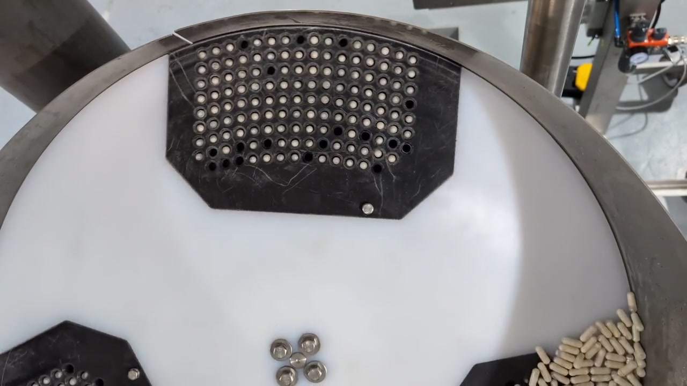

# Capsule counting

## Problem description

We want to count capsules placed in a special holder in a machine to see if the holder is full or not. This will be then used to indicate to the machine that the holder is full which triggers an action on the machine side. We will do this by capturing and labeling our data as we did in our [hello world example](../getting-started/hello-world.md). The AI model we will use will be a more advanced one used for object detection, which we'll deploy and link its output to the controller for sending signals to the machine.

<figure><figcaption><p>The machine containing 3 holders for capsules</p></figcaption></figure>

## Collecting data

To collect the data, we will use a more automated approach than in our [hello world example](../getting-started/hello-world.md). We will create a function that captures a defined number of images from the camera at specific times automatically.

```python
import os
import requests
import time

API_BASE = "http://robopipe-controller-1.local"
mxid = "123456789"
sensor_name = "CAM_A"

def save_image(path: str, image: bytes):
    dirname = os.path.dirname(path)

    if not os.path.exists(dirname):
        os.makedirs(dirname)

    with open(path, "wb") as f:
        f.write(image)

def capture_images(n: int, delay: float):
    for i in range(n):
        img_res = requests.get(
            f"{API_BASE}/cameras/{mxid}/sensors/{sensor_name}/still"
        )
        img = img_res.content
        save_image(f"data/{i}.jpeg", img)
        time.sleep(delay)
```

Now we can call `capture_images` to start collecting the data. It will capture capture a total of `n` images, waiting for `delay` seconds between individual captures.

## Data labeling

We will once again use [label studio](https://labelstud.io/) for labeling. If you haven't already, take a look at our [hello world example](../getting-started/hello-world.md#data-labeling) to see how to install and set up label studio.

### Project setup

We will create a new project in label studio. In the "_labeling setup_" tab, we will choose "_Object Detection with Bounding Boxes_" and create classes according to our project. We only need one class "_capsule_".

<figure><figcaption></figcaption></figure>

### Labeling

First, we will import our captured images. Simply click on "_Import_" button, and select the images we wish to label. Next we can start labeling our images. Click on "_Label All Tasks_", select the class you wish to use and draw a rectangle bounding the object in the picture. Do this for every object that you wish to detect as well as for every image on which the model will be trained.

<figure><figcaption></figcaption></figure>

### Data export

After we're done labeling our images, we can finally export the labeled data which we will use for training our model. Click on "_Export_" and select "_YOLO_" as the export format. A zip file containing the exported data will be downloaded.

## Training the model

For the model we will use [YOLOv8](https://docs.ultralytics.com/models/yolov8/), which is a pre-built model by [ultralytics](https://www.ultralytics.com/), instead of building our own.

### Configuration

&#x20;In order to use this model, we must create a configuration file describing our data. We will save this in a file named `dataset.yaml`, which we will reference below, you can use any filename but be sure to change the code accordingly.

```yaml
path: /path/to/our/exported/dataset
train: images
val: images

names:
  0: capsule
```

### Training

Now we can train the model on our custom dataset. First, we must install the model.

```bash
python3 -m pip install ultralytics
```

Next we can train the model. Feel free to tweak the parameters to your liking.

```python
from ultralytics import YOLO

model = YOLO("yolov8n.pt")
model.train(data="dataset.yaml", epochs=20, imgsz=640)
```

### Model export

As we did in the previous example, in order to deploy the model on a Robopipe device, we must first export it in the suitable format. To find out more about model export, take a look at our [hello world example](../getting-started/hello-world.md#exporting-the-model-to-onnx-format).

```python
import blobconverter
import os

export_path = model.export(format="onnx")
blob_path = blobconverter.from_onnx(export_path)
os.rename(blob_path, "model.blob")
```

## Deployment

To deploy the model we will use our API. We will laverage the fact the we use a YOLO model and use configuration specific to this type of model. The benefit is that when reading the model's output from the API, we will get already interpreted results, which are easy to work with.

```python
import json

def deploy_model(path="model.blob"):
    nn_config = {
        "type": "YOLO",
        "nn_config": {
            "confidence_threshold": 0.5,
            "num_classes": 1,
            "coordinate_size": 4,
        },
    }
    return requests.post(
        f"{API_BASE}/cameras/{mxid}/sensors/{sensor_name}/nn",
        files={"model": open(path, "rb")},
        data={"nn_config": json.dumps(nn_config)},
    )
```

## Running inference

The model is already running on the device from the point we deployed it. Now we will read and interpret the results and use them to control our machine.

### Reading the model output

The data received from the websocket is an array, containing objects, each of which has the following fields:

* label - an integer indicating the label of the detection, e.g. 0 for capsule in our case, as we specified in the `dataset.yaml` above
* confidence - a floating point number in the range \[0;1] indicating the model's confidence about the detection, higher number means larger confidence indicating that the detection is more accurate.
* coords - array of 4 floats, representing the bounding box for the detection

```python
import anyio
import websockets

WS_BASE=f"ws://robopipe-controller-{ID}.local"

async def main():
    async with websockets.connect(
        f"{WS_BASE}/cameras/{mxid}/sensors/{sensor_name}/nn"
    ) as ws:
        while True:
            msg = await ws.recv()
            print(msg)

anyio.run(main)
```

### Connecting to the machine

Robopipe controller is not just an ordinary controller, but a fully fledged PLC, which means that we can use it to controll our machine's behaviour. For the purpose of this example, we will indicate the result using all LEDs on the controller, but the use cases can be far beyond that. For example, you can have all sorts of devices connected to analog or digital I/O of the controller, and controll them using the API.

In this example, we will simply turn on the led when a specified number of capsules has been detected, and turn it off when the number gets below that. We will define a function which we will use in our `main` function above, which will do this.

```python
import json

THRESHOLD = 50

def process_detections(detections: str):
    parsed_detections = json.loads(detections)
    
    if len(parsed_detections) >= THRESHOLD:
        requests.post(f"{API_BASE}/controller/led", data={"value": True})
    else:
        requests.post(f"{API_BASE}/controller/led", data={"value": False})
```

All that's left is to modify our `main` function to call `process_detections` and let it run.

```python
import anyio
import websockets

WS_BASE=f"ws://robopipe-controller-{ID}.local"

async def main():
    async with websockets.connect(
        f"{WS_BASE}/cameras/{mxid}/sensors/{sensor_name}/nn"
    ) as ws:
        while True:
            msg = await ws.recv()
            process_detections(msg)

anyio.run(main)
```
