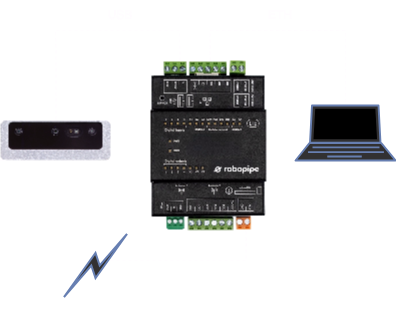

# Connection

## Controller


In case of any manipulation with the controller, first turn off all power sources as there is a risk of electrocution or damage. Improper handling can result in significant property damage, bodily injury or death. Please refer to [Unipi Patron manual](https://kb.unipi.technology/_media/en:files:products:unipi-patron-manual-en.pdf) to read all safety instructions.&#x20;


### Connection using router

Connect the controller and luxonis camera to a router with running DHCP server (most routers have DHCP server on by default) and then connect the controller to a power supply as shown in the diagram below.

<div data-full-width="false"><figure><figcaption></figcaption></figure></div>

### Direct connection

Connect the luxonis camera directly to the controller via USB and then connect the controller to your PC via ethernet as shown in the diagram below.

<div data-full-width="false"><figure><figcaption></figcaption></figure></div>

### Accessing the controller

The easiest way to check if everything is running is to head over to `http://robopipe-controller-<id>.local`, where _id_ is the a number assigned to each controller on startup, based on the order in which you start the controllers, e.g. the first controller you connect will have id 1, the next will have id 2 and so on. You should see output:&#x20;

```
Hello from Robopipe API!
```

The controller is also accesible via [SSH](https://en.wikipedia.org/wiki/Secure_Shell). The default hostname is set to `robopipe-controller-<id>.local`. The default user is `robopipe` with password `robopipe.io`. Enter this command into your terminal to connect to the controller, enter `robopipe.io` when prompted for password:

```bash
ssh robopipe@robopipe-controller-<id>.local
```

When connecting for the first time, you will be asked to verify the authenticity of the controller's key. Enter `yes` and press enter.

## Accepting the controller's certificate

In order to be able to use the [API Reference](../api/api-reference/) in full, you first need to accept the controller's self signed certificate. For each controller you have started, navigate to https://robopipe-controller-\<id>.local in your browser. You will be asked to accept security risks.



Click on "**Advanced**", then click "**Proceed to robopipe-controller-\<id>.local**".



Click on "**Advanced...**", then click on "**Accept the Risk and Continue**" (it takes a second for this button to become enabled).



Click on "**Show Details**", then click on "**visit this website**" and lastly click on "**Visit Website**".


