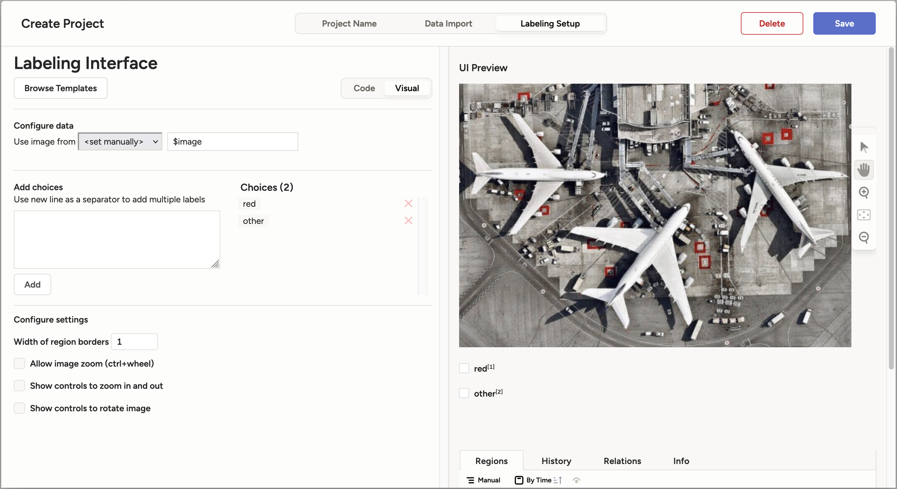

# Hello world

## Description

This guide walks you through the basics of working with your Robopipe device. You'll learn how to:

* Capture images from a connected device
* Label data for training an AI model
* Build and deploy a simple neural network co classify objects as "black" or "other"

By the end you'll have a fully functioning AI model running directly on a Robopipe device.

The complete example with all the python code is available below. The jupyter notebook used for training the model and the model conversion is also available below.





## Listing devices

In order to capture training data we need to specify device from which to capture from. To do this we will list all devices.


```python
import requests

ID = 1 # substitue with the id of your controller
API_BASE = f"http://robopipe-controller-{ID}.local"

# fetch connected devices from the robopipe controller
def get_devices():
    return requests.get(f"{API_BASE}/cameras").json()

devices = get_devices()
```


Devices will contain an array of connected devices, containing their MXID along with other information. To find out more about devices API head over to the [API reference](../api/api-reference/cameras.md#cameras).

We will use the first device.

```python
mxid = devices[0].get("mxid")
```

We will also need to select a camera. To list all cameras you can use the function below.

```python
# retrieve the list of cameras associated with the selected device (mxid)
def get_cameras(mxid: str):
    return requests(f"{API_BASE}/cameras/{mxid}/sensors").json()
```

In my case, I will choose the first returned camera, which is _CAM\_A_. _CAM\_A_ is usually the RGB camera on most devices.

```python
sensor_name = list(get_cameras().keys())[0]
```

## Capturing images

In order to train our model we first need to get the training data. These data will be RGB images captured by our device via out API. We will create a function that retrieves an image from the API and saves it to our defined location whenever we type 's' into the terminal. Visit other examples to see how to capture data automatically.

```python
import os

def save_image(path: str, image: bytes):
    dirname = os.path.dirname(path)

    if not os.path.exists(dirname):
        os.makedirs(dirname)

    with open(path, "wb") as f:
        f.write(image)


def capture_data():
    i = 1

    while True:
        key = input("Enter input ('s' to save image, 'q' to quit): ")

        if key == "s":
            image_response = requests.get(
                f"{API_BASE}/cameras/{mxid}/sensors/{sensor_name}/still"
            )
            image = image_response.content
            save_image(f"data/{i}.jpeg", image)
            i += 1
        elif key == "q":
            break
```

To capture data we simply call `capture_data()`. This will, however, capture the data in full camera resolution, which might not be desired. In our case, the model will be trained on images of size 200x200. We can create another function, which will properly configure the camera, so that the captured images are the right size. There are numerous options which you can configure via the [config](../api/api-reference/sensors.md#cameras-mxid-sensors-sensor_name-config) and [control](../api/api-reference/sensors.md#cameras-mxid-sensors-sensor_name-control) API.

```python
def configure_camera(width: int, height: int):
    data = {"still_size": (width, height)}
    return requests.post(
        f"{API_BASE}/cameras/{mxid}/sensors/{sensor_name}/config", data
    ).json()
```


Capturing images in high resolution may require more processing power and storage. Use appropriate resolutions for your application.


## Data labeling

We will use [label studio](https://labelstud.io/) for labeling.

```bash
# Install and run label studio
pip install label-studio
label-studio start
```

Now head over to [http://localhost:8080](http://localhost:8080), create an account and create a new empty project. In the labeling setup tab, choose _Image Classification_, and enter _red_ and _other_ as choices. After you're done with the project configuration, click _Save_.

<figure><figcaption></figcaption></figure>

Now we can import our data. Click in "_go to import_" and select the folder in which you have saved the captured images and import selected images. Now click on "_Label all tasks_" and you can start labeling.

<figure><figcaption></figcaption></figure>

For each image, select either "_black_" or "_other_" and click on "_submit_".

After you are done with labeling, go back to the project overview, click on "_export_" and export your data as **CSV**. We will need this for the next step.

## Building the model

First, we will need some lilbraries. We build and train the model using [PyTorch](https://pytorch.org). We will use pandas and pillow for loading the data. All this will be done in jupyter notebook, you can use Visual Studio Code or any tool of your preference to view and edit the notebook. The notebook is available for download above in the [description](hello-world.md#description).

### Dataset

We will build a custom dataset class, which will load our images along with the label data form a specified location and use specified transformers to manipulate the data.

```python
class MyDataset(Dataset):
    def __init__(self, csv_file, img_dir, transform=None):
        self.data = pd.read_csv(csv_file)
        self.img_dir = img_dir
        self.transform = transform

        self.label_mapping = {"black": 1, "other": 0}
        self.data['choice'] = self.data['choice'].map(self.label_mapping)
    
    def __len__(self):
        return len(self.data)
    
    def __getitem__(self, idx):
        img_path = f"{self.img_dir}/{self.data.iloc[idx]['image'].split('-')[1]}"
        image = Image.open(img_path).convert("RGB")
        label = self.data.iloc[idx]['choice']
        label = torch.tensor(label, dtype=torch.float32)

        if self.transform:
            image = self.transform(image)

        return image, label
    
transform = transforms.Compose([
    transforms.ToTensor(),
    transforms.Normalize((0.5,), (0.5,))
])

img_dir = "data"
csv_file = "data-labels.csv"
dataset = MyDataset(csv_file, img_dir, transform)
dataloader = DataLoader(dataset, batch_size=2, shuffle=True)
```

### Neural network

Next we will build and train the neural network itself. We create a class `SimpleNN`. This network will only have 3 layers to keep things simple - input, output, and 1 hidden layer. For the activation function we will use RelU.

```python
class SimpleNN(nn.Module):
    def __init__(self):
        super().__init__()
        self.fc1 = nn.Linear(200*200*3, 128) # 200*200*3 is our input - RGB (3 channels) image 200x200
        self.fc2 = nn.Linear(128, 64)
        self.fc3 = nn.Linear(64, 1)
    
    def forward(self, x):
        x = x.view(x.size(0), -1)
        x = torch.relu(self.fc1(x))
        x = torch.relu(self.fc2(x))
        x = torch.sigmoid(self.fc3(x))

        return x
```

Now we can train the model, feel free to tweak the parameters to your liking.

```python
model = SimpleNN()
criterion = nn.BCELoss()
optimizer = optim.Adam(model.parameters(), lr=0.001)

epochs = 10
for epoch in range(epochs):
    model.train()
    for images, labels in dataloader:
        labels = labels.float().unsqueeze(1)
        outputs = model(images)
        loss = criterion(outputs, labels)

        optimizer.zero_grad()
        loss.backward()
        optimizer.step()
    
    print(f"Epoch [{epoch+1}/{epochs}], Loss: {loss.item():.4f}")

model.eval()
```

When looking at the output, you should observe that the loss is getting smaller.

## Converting the model

In order to be able to deploy the network on our device, we must first convert it to a suitable format. Luxonis uses MyriadX blob format. To see conversion guides for models built with frameworks other than PyTorch, please refer to [Luxonis Conversion Guide](https://docs.luxonis.com/software/ai-inference/conversion).

### Exporting the model to ONNX format

This will save our model in the ONNX format into `model.onnx`.

```python
dummy_input = torch.rand(1, 3, 200, 200)
torch.onnx.export(
    model, dummy_input, 
    "model.onnx", 
    export_params=True, 
    opset_version=11, 
    input_names=['input'], 
    output_names=['output']
)
```

To finally obtain a file we can upload into our device we will use [blobconverter](https://github.com/luxonis/blobconverter). You can install it via pip.

```bash
python3 -m pip install blobconverter
```

```python
import blobconverter
import os

blob_path = blobconverter.from_onnx("model.onnx")
os.rename(blob_path, "model.blob")
```

## Deployment

To deploy out model we will use our API.

```python
def deploy_model(path="model.blob"):
    requests.post(
        f"{API_BASE}/cameras/{mxid}/sensors/{sensor_name}/nn",
        files={"model": open(path, "rb")},
    )
```

Calling this function will take a few seconds, since the camera needs to load the model and restart. After it is finished, we can finally observe the model working. For that we will create a simple websocket client, that connects to our API and receives data straight from our controller containing the output of the model.

```python
import anyio
import websockets

WS_BASE=f"ws://robopipe-controller-{ID}.local"

async def main():
    async with websockets.connect(
        f"{WS_BASE}/cameras/{mxid}/sensors/{sensor_name}/nn"
    ) as ws:
        while True:
            msg = await ws.recv()
            print(msg)


anyio.run(main)
```

**Congratulations!**\
You've successfully:

* Captured and labeled data.
* Trained a custom AI model.
* Deployed it to a Robopipe device.

Explore our [Examples Page](broken-reference) for more advanced projects and ideas.
